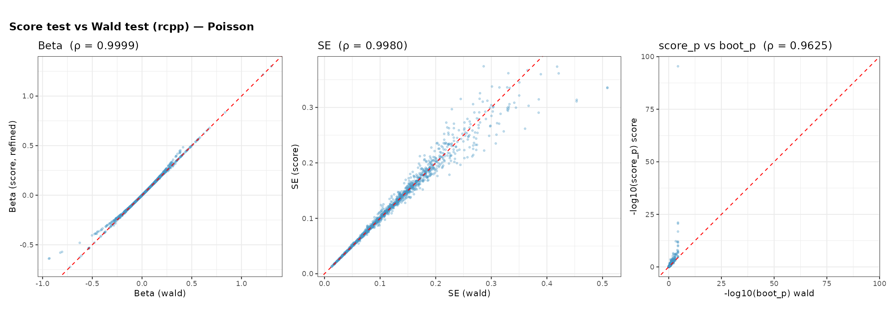
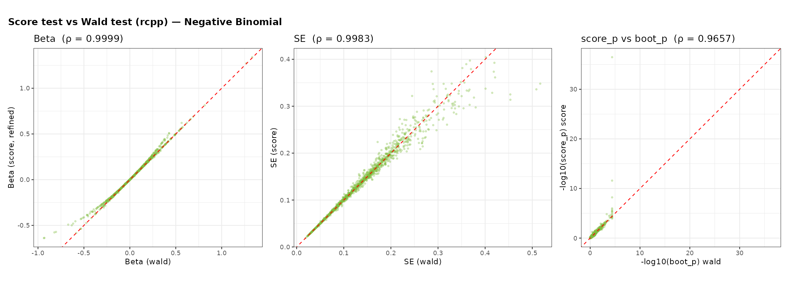

# ASCENT

**Accelerated Single-Cell ENhancer Target gene linking**

ASCENT is a high-performance R package for linking cis-regulatory elements (ATAC-seq peaks) to their target genes using single-cell multimodal (RNA + ATAC) data. It is a reimplementation of the [SCENT](https://github.com/immunogenomics/SCENT) algorithm in Rcpp/C++ with OpenMP parallelism, delivering **~20x faster runtime** while producing numerically identical results. Unlike the R implementations which `fork()` the entire R session for each bootstrap core (memory scales linearly with core count), ASCENT uses shared-memory OpenMP threads — memory stays constant regardless of how many cores are used.

---

## Why ASCENT?

SCENT is a powerful statistical framework for identifying enhancer-gene links, but its native R implementation becomes prohibitively slow at genome-wide scale. A typical analysis involves tens of thousands of peak-gene pairs, each requiring up to 50,000 bootstrap GLM fits.

ASCENT provides three computational backends — the original SCENT algorithm (`glm`), an intermediate R-based optimisation that swaps `glm()` for the faster [`fastglm`](https://cran.r-project.org/package=fastglm) library (`fastglm`), and the full C++/OpenMP engine (`rcpp`) — and two statistical tests: the original **Wald test** with adaptive bootstrap, and a new **score test** that eliminates bootstrapping entirely:

#### Wald test (adaptive bootstrap)

| | glm (original SCENT) | fastglm | rcpp (ASCENT) |
|---|---|---|---|
| **Poisson (1,800 pairs, 8 cores)** | 12,918 sec | 7,200 sec | **597 sec** |
| **Poisson speedup** | 1.0x (baseline) | 1.8x | **21.6x** |
| **NegBin (32 pairs, 8 cores)** | 6,505 sec | 341 sec | **82 sec** |
| **NegBin speedup** | 1.0x (baseline) | 19.1x | **79.3x** |
| **Numerical agreement** | — | r = 1.000000 | r = 1.000000 |

#### Score test (no bootstrap)

| | glm | fastglm | rcpp (ASCENT) |
|---|---|---|---|
| **Poisson (1,800 pairs, 8 cores)** | 13.0 sec | 2.1 sec | **0.9 sec** |
| **Poisson speedup vs glm wald** | 994x | 6,152x | **14,700x** |
| **NegBin (1,800 pairs, 8 cores)** | 28.8 sec | 5.7 sec | **8.6 sec** |
| **NegBin speedup vs glm wald** | 5,524x | 27,928x | **18,540x** |
| **Concordance with wald (p < 0.05)** | — | — | **97–99%** |

*Benchmark on 2,286 CD14 Mono cells. The `glm` method uses base R `glm()` / `MASS::glm.nb()` and is identical to the original SCENT implementation. The `fastglm` method is an R-based optimisation developed as part of ASCENT that replaces the GLM solver with `fastglm::fastglm()`. The `rcpp` method is the full C++/OpenMP engine — the primary contribution of ASCENT.*


ASCENT is a **drop-in replacement** for SCENT. The Wald test preserves the same statistical model (Poisson/Negative Binomial GLM with adaptive bootstrap p-values). The score test provides an analytically equivalent alternative that is orders of magnitude faster, making genome-wide analyses feasible even at large cell counts.


*Wald test: Beta and SE are numerically identical (ρ ≥ 0.999). Bootstrap p-values show high concordance (ρ ≈ 0.94); the scatter is expected because ASCENT and SCENT use independent RNG streams.*





*Score test: `score_beta` lands on the 1:1 line with the Wald MLE — unbiased in magnitude, not just in rank (Spearman ρ = 0.9999). The model-based SE closely tracks the Wald SE. Score p-values are highly concordant with bootstrap p-values (ρ > 0.96).*

For a detailed explanation of the optimizations, see [DEEP_README.md](DEEP_README.md).

---

## Installation

### Prerequisites

- R >= 3.5.0
- A C++ compiler with C++14 and OpenMP support (GCC >= 5, Clang >= 3.7)
- [RcppArmadillo](https://cran.r-project.org/package=RcppArmadillo) and [Rcpp](https://cran.r-project.org/package=Rcpp)

### Install from source

```r
# Install dependencies
install.packages(c("Rcpp", "RcppArmadillo", "Matrix", "data.table", "stringr", "Hmisc"))

# Install ASCENT from GitHub
devtools::install_github("ducbch/ASCENT")
```

### Optional dependencies

These are only needed for the fallback methods (`method = "fastglm"` or `method = "glm"`):

```r
install.packages(c("fastglm", "boot", "MASS"))
```

### Verify installation

```r
library(ASCENT)
?ASCENT_algorithm
```

---

## Quick Start

### 1. Prepare your data

ASCENT requires:
- **RNA count matrix** (`dgCMatrix`): genes x cells
- **ATAC count matrix** (`dgCMatrix`): peaks x cells
- **Cell metadata** (`data.frame`): must include a `cell` column matching the matrix column names, covariates, and a cell-type column
- **Peak-gene pairs** (`data.frame`): two columns — `gene` (matching RNA rownames) and `peak` (matching ATAC rownames)

```r
library(ASCENT)
library(Matrix)

# Example: extract from a Seurat multiome object
rna_mat  <- GetAssayData(sobj, assay = "RNA",  layer = "counts")
atac_mat <- GetAssayData(sobj, assay = "ATAC", layer = "counts")

meta <- data.frame(
  cell      = colnames(rna_mat),
  log_nUMI  = log(sobj$nCount_RNA),
  log_nATAC = log(sobj$nCount_ATAC),
  celltype  = sobj$celltype
)

peak_info <- data.frame(
  gene = c("CD14", "CD14", "LYZ"),
  peak = c("chr5-140588413-140588992", "chr5-140595262-140596150", "chr12-69343211-69344057")
)
```

### 2. Create an ASCENT object

```r
obj <- CreateASCENTObj(
  rna        = rna_mat,
  atac       = atac_mat,
  meta.data  = meta,
  peak.info  = peak_info,
  covariates = c("log_nUMI", "log_nATAC"),
  celltypes  = "celltype"
)
```

### 3. Run the algorithm

#### Wald test (default — with adaptive bootstrap)

```r
result <- ASCENT_algorithm(
  obj,
  celltype = "CD14 Mono",
  ncores   = 8L,          # OpenMP threads
  regr     = "poisson",   # or "negbin"
  bin      = TRUE,         # binarize ATAC counts
  method   = "rcpp",       # "rcpp" (default), "fastglm", or "glm"
  test     = "wald"        # default
)

# View results (sorted by bootstrap p-value)
res <- result@ASCENT.result
res[order(res$boot_basic_p), ]
#   gene                      peak        beta         se         z            p boot_basic_p
#   CD14  chr5-140588413-140588992  0.20862497 0.04127407  5.054626 4.312349e-07      0.00004
#   CD14  chr5-140595262-140596150  0.10122057 0.02974222  3.403262 6.658641e-04      0.00632
#    LYZ  chr12-69343211-69344057  0.08044277 0.01179825  6.818193 9.219273e-12      0.00688
```

#### Score test (recommended for large-scale analyses)

```r
result <- ASCENT_algorithm(
  obj,
  celltype = "CD14 Mono",
  ncores   = 8L,
  regr     = "poisson",   # or "negbin"
  bin      = TRUE,
  method   = "rcpp",
  test     = "score"       # score test — no bootstrap
)

# View results (sorted by score p-value)
res <- result@ASCENT.result
res[order(res$score_p), ]
#   gene                      peak   score_beta    score_se   score_z      score_p
#   CD14  chr5-140588413-140588992   0.20742186  0.04258803  4.870774 1.112e-06
#   CD14  chr5-140595262-140596150   0.10003481  0.03063102  3.265694 1.093e-03
#    LYZ  chr12-69343211-69344057   0.07981655  0.01215423  6.566522 5.147e-11
```

### 4. Generate peak-gene pairs from genome annotation (optional)

If you don't have pre-defined pairs, use `CreatePeakToGeneList` with a gene body BED file:

```r
obj <- CreatePeakToGeneList(
  obj,
  genebed = "/path/to/GeneBody_500kb_margin.bed",
  nbatch  = 10
)
# Pairs are stored in obj@peak.info.list (batched for external parallelisation)
```

---

## Method and Test Options

### `method` — computational backend

`method` applies to the **Wald test only**. The **score test always runs on `"rcpp"`** (if `"fastglm"`/`"glm"` is requested with `test = "score"`, it falls back to `"rcpp"` with a message).

| Method | Description | When to use |
|--------|-------------|-------------|
| `"rcpp"` | Full C++/OpenMP engine developed in ASCENT. Parallelizes across pairs. | Default. Production use. |
| `"fastglm"` | R reference using [`fastglm::fastglm()`](https://cran.r-project.org/package=fastglm); bootstrap via `boot::boot(parallel = "multicore")`. Wald only. | Validation. |
| `"glm"` | Original SCENT implementation using base `glm()` / `MASS::glm.nb()`. Wald only. | Ground-truth SCENT reference. |

The three Wald backends produce numerically equivalent results (beta correlation = 1.000000). `fastglm`, `MASS`, and `boot` are `Suggests` — needed only for the non-default Wald backends.

### `test` — statistical test

| Test | Description | When to use |
|------|-------------|-------------|
| `"wald"` | Wald test with adaptive bootstrap p-values (original SCENT approach). Up to 50,000 bootstrap replicates per pair. | Default. When exact bootstrap p-values are needed. |
| `"score"` | Model-based score test (rcpp only): an analytic p-value and a refined coefficient estimate for every pair, with no resampling. | Recommended for large-scale analyses. Orders of magnitude faster than the Wald+bootstrap workflow. |

The score test computes beta, SE, z, and an analytic p for all pairs without resampling. An **opt-in** selective bootstrap is available via `score_boot_z` (default `Inf` = off): setting a finite value (e.g. `2`) additionally fits the full GLM and adaptively bootstraps the pairs with `|score_z| > score_boot_z`, giving a robust `boot_p` for the significant subset. It is off by default because the bootstrap cost concentrates in those significant pairs, so enabling it makes the score test roughly as slow as the Wald+bootstrap test.

---

## Output

`ASCENT_algorithm` returns an ASCENT S4 object with the `@ASCENT.result` slot populated as a `data.frame`:

#### Wald test (`test = "wald"`)

| Column | Description |
|--------|-------------|
| `gene` | Gene name |
| `peak` | Peak name |
| `beta` | ATAC coefficient from the GLM |
| `se` | Standard error of the ATAC coefficient |
| `z` | z-statistic (`beta / se`) |
| `p` | Wald p-value (two-sided) |
| `boot_basic_p` | Empirical p-value from adaptive bootstrap (primary result) |

#### Score test (`test = "score"`)

| Column | Description |
|--------|-------------|
| `gene` | Gene name |
| `peak` | Peak name |
| `score_beta` | Coefficient estimate: the one-step Newton-Raphson value for small effects, cheaply refined to the full-model MLE for significant pairs (`\|score_z\| > 2`) |
| `score_se` | Model-based standard error |
| `score_z` | z-statistic (`score_beta / score_se`) |
| `score_p` | Score test p-value (two-sided, analytic) |
| `boot_p` | Adaptive-bootstrap p-value. `NA` by default; populated only when the opt-in bootstrap is enabled (`score_boot_z` finite), for the pairs with `\|score_z\| > score_boot_z` |
| `score_U` | Score statistic (`sum(b_tilde * e_star)`) |
| `score_V` | Fisher information (`sum(b_tilde^2 * W)`) |
| `score_stat` | Chi-squared(1) test statistic (`score_U^2 / score_V`) |

Pairs that fail the quality filter (<=5% nonzero in either modality) are excluded from the output.

---

## Credits

ASCENT is developed by **Duc Nguyen** at the Lee Lab, Boston Children's Hospital.

The statistical framework (Poisson/NB GLM with adaptive bootstrap) is from the original SCENT package:

> **Sakaue, S.**, Weinand, K., Isaac, S., Dey, K.K. et al. (2024). Tissue-specific enhancer-gene maps from multimodal single-cell data identify causal disease alleles. *Nature Genetics*. [doi:10.1038/s41588-024-01682-1](https://doi.org/10.1038/s41588-024-01682-1)

SCENT source code: [https://github.com/immunogenomics/SCENT](https://github.com/immunogenomics/SCENT)

---

## License

MIT
