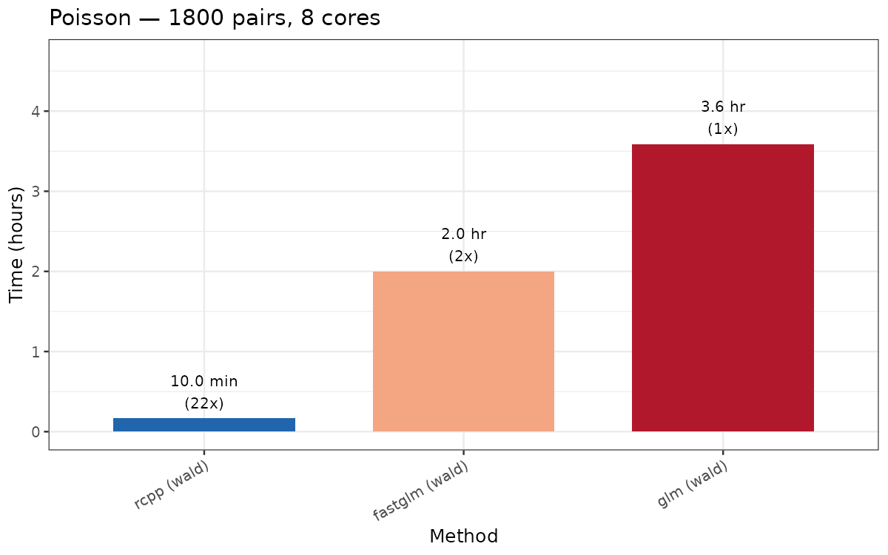
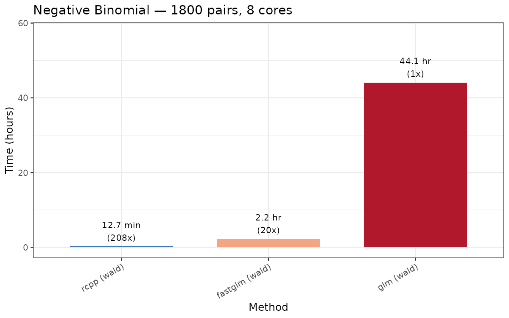
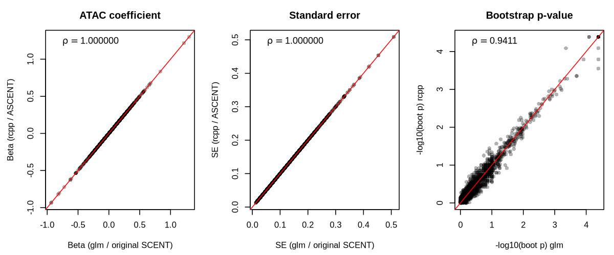
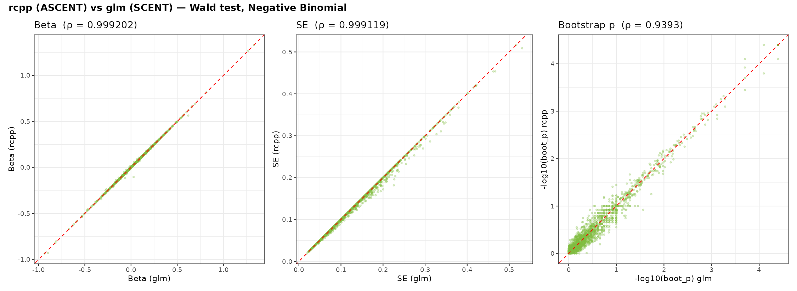

# ASCENT

**Accelerated Single-Cell ENhancer Target gene linking**

ASCENT is a high-performance R package for linking cis-regulatory elements (ATAC-seq peaks) to their target genes using single-cell multimodal (RNA + ATAC) data. It is a reimplementation of the [SCENT](https://github.com/immunogenomics/SCENT) algorithm in Rcpp/C++ with OpenMP parallelism, delivering **~20x faster runtime** while producing numerically identical results. Unlike the R implementations which `fork()` the entire R session for each bootstrap core (memory scales linearly with core count), ASCENT uses shared-memory OpenMP threads — memory stays constant regardless of how many cores are used.

---

## Why ASCENT?

SCENT is a powerful statistical framework for identifying enhancer-gene links, but its native R implementation becomes prohibitively slow at genome-wide scale. A typical analysis involves tens of thousands of peak-gene pairs, each requiring up to 50,000 bootstrap generalized linear model (GLM) fits.

ASCENT provides three computational backends — the original SCENT algorithm (`glm`), an intermediate R-based optimisation that swaps `glm()` for the faster [`fastglm`](https://cran.r-project.org/package=fastglm) library (`fastglm`), and the full C++/OpenMP engine (`rcpp`) — and two statistical tests: the original **Wald test** with adaptive bootstrap, and a fast **score test** with an analytic p-value and a refined effect-size estimate.

*Benchmarks below are on 2,286 CD14 Mono cells, 1,800 peak-gene pairs, 8 cores. The `glm` method uses base R `glm()` / `MASS::glm.nb()` and is identical to the original SCENT implementation. The `fastglm` method is an R-based optimisation developed as part of ASCENT that replaces the GLM solver with `fastglm::fastglm()`. The `rcpp` method is the full C++/OpenMP engine — the primary contribution of ASCENT.*





ASCENT is a **drop-in replacement** for SCENT. The Wald test preserves the same statistical model (Poisson/Negative Binomial GLM with adaptive bootstrap p-values). The score test provides a fast alternative — an analytic p-value and a refined effect-size estimate per pair (with an optional bootstrap) — making genome-wide analyses feasible even at large cell counts.





*Wald test: beta and standard error are numerically identical (correlation of at least 0.999). Bootstrap p-values are highly concordant (correlation around 0.94); the scatter is expected because ASCENT and SCENT use independent random-number generators.*

The score test is described in the [Score test](#score-test) section below. For a detailed explanation of the optimizations, see [DEEP_README.md](DEEP_README.md).

---

## Installation

### Prerequisites

- R >= 3.5.0
- A C++ compiler with C++14 and OpenMP support (GCC >= 5, Clang >= 3.7)
- [RcppArmadillo](https://cran.r-project.org/package=RcppArmadillo) and [Rcpp](https://cran.r-project.org/package=Rcpp)

### Install from source

```r
# Install dependencies
install.packages(c("Rcpp", "RcppArmadillo", "Matrix", "data.table", "stringr", "Hmisc"))

# Install ASCENT from GitHub
devtools::install_github("ducbch/ASCENT")
```

### Optional dependencies

These are only needed for the fallback methods (`method = "fastglm"` or `method = "glm"`):

```r
install.packages(c("fastglm", "boot", "MASS"))
```

### Verify installation

```r
library(ASCENT)
?ASCENT_algorithm
```

---

## Quick Start

### 1. Prepare your data

ASCENT requires:
- **RNA count matrix** (`dgCMatrix`): genes x cells
- **ATAC count matrix** (`dgCMatrix`): peaks x cells
- **Cell metadata** (`data.frame`): must include a `cell` column matching the matrix column names, covariates, and a cell-type column
- **Peak-gene pairs** (`data.frame`): two columns — `gene` (matching RNA rownames) and `peak` (matching ATAC rownames)

```r
library(ASCENT)
library(Matrix)

# Example: extract from a Seurat multiome object
rna_mat  <- GetAssayData(sobj, assay = "RNA",  layer = "counts")
atac_mat <- GetAssayData(sobj, assay = "ATAC", layer = "counts")

meta <- data.frame(
  cell      = colnames(rna_mat),
  log_nUMI  = log(sobj$nCount_RNA),
  log_nATAC = log(sobj$nCount_ATAC),
  celltype  = sobj$celltype
)

peak_info <- data.frame(
  gene = c("CD14", "CD14", "LYZ"),
  peak = c("chr5-140588413-140588992", "chr5-140595262-140596150", "chr12-69343211-69344057")
)
```

### 2. Create an ASCENT object

```r
obj <- CreateASCENTObj(
  rna        = rna_mat,
  atac       = atac_mat,
  meta.data  = meta,
  peak.info  = peak_info,
  covariates = c("log_nUMI", "log_nATAC"),
  celltypes  = "celltype"
)
```

### 3. Run the algorithm

#### Wald test (default — with adaptive bootstrap)

```r
result <- ASCENT_algorithm(
  obj,
  celltype  = "CD14 Mono",
  ncores    = 8L,          # OpenMP threads
  regr      = "poisson",   # or "negbin"
  bin       = TRUE,         # binarize ATAC counts
  method    = "rcpp",       # "rcpp" (default), "fastglm", or "glm"
  test      = "wald",       # default
  bootstrap = TRUE          # TRUE (default) = adaptive bootstrap p-value; FALSE = asymptotic only
)

# View results (sorted by bootstrap p-value)
res <- result@ASCENT.result
res[order(res$boot_basic_p), ]
#   gene                      peak        beta         se         z            p boot_basic_p
#   CD14  chr5-140588413-140588992  0.20862497 0.04127407  5.054626 4.312349e-07      0.00004
#   CD14  chr5-140595262-140596150  0.10122057 0.02974222  3.403262 6.658641e-04      0.00632
#    LYZ  chr12-69343211-69344057  0.08044277 0.01179825  6.818193 9.219273e-12      0.00688
```

#### Score test (recommended for large-scale analyses)

```r
result <- ASCENT_algorithm(
  obj,
  celltype = "CD14 Mono",
  ncores   = 8L,
  regr     = "negbin",    # or "poisson"
  bin      = TRUE,
  method   = "rcpp",
  test     = "score",      # analytic p-value + refined beta
  bootstrap = FALSE        # FALSE = fast analytic-only; TRUE adds boot_p
)

# View results (sorted by score p-value)
res <- result@ASCENT.result
res[order(res$score_p), ]
#   gene                      peak   score_beta    score_se   score_z      score_p
#   CD14  chr5-140588413-140588992   0.20742186  0.04258803  4.870774 1.112e-06
#   CD14  chr5-140595262-140596150   0.10003481  0.03063102  3.265694 1.093e-03
#    LYZ  chr12-69343211-69344057   0.07981655  0.01215423  6.566522 5.147e-11
```

### 4. Generate peak-gene pairs from genome annotation (optional)

If you don't have pre-defined pairs, use `CreatePeakToGeneList` with a gene body BED file:

```r
obj <- CreatePeakToGeneList(
  obj,
  genebed = "/path/to/GeneBody_500kb_margin.bed",
  nbatch  = 10
)
# Pairs are stored in obj@peak.info.list (batched for external parallelisation)
```

---

## Method and Test Options

### `method` — computational backend

`method` applies to the **Wald test only**. The **score test always runs on `"rcpp"`** (if `"fastglm"`/`"glm"` is requested with `test = "score"`, it falls back to `"rcpp"` with a message).

| Method | Description | When to use |
|--------|-------------|-------------|
| `"rcpp"` | Full C++/OpenMP engine developed in ASCENT. Parallelizes across pairs. | Default. Production use. |
| `"fastglm"` | R reference using [`fastglm::fastglm()`](https://cran.r-project.org/package=fastglm); bootstrap via `boot::boot(parallel = "multicore")`. Wald only. | Validation. |
| `"glm"` | Original SCENT implementation using base `glm()` / `MASS::glm.nb()`. Wald only. | Ground-truth SCENT reference. |

The three Wald backends produce numerically equivalent results (beta correlation = 1.000000). `fastglm`, `MASS`, and `boot` are `Suggests` — needed only for the non-default Wald backends.

### `test` — statistical test

| Test | Description | When to use |
|------|-------------|-------------|
| `"wald"` | Wald test with adaptive bootstrap p-values (original SCENT approach). Up to 50,000 bootstrap replicates per pair. | Default. When exact bootstrap p-values are needed. |
| `"score"` | Model-based score test (rcpp only): an analytic p-value and a refined coefficient estimate for every pair, plus an optional adaptive bootstrap (`boot_p`) over all pairs. | Large-scale analyses. With `bootstrap = FALSE`, the analytic-only score test is orders of magnitude faster than the Wald+bootstrap workflow. |

See the [Score test](#score-test) section for the implementation and the refined-beta method.

---

## Output

`ASCENT_algorithm` returns an ASCENT S4 object with the `@ASCENT.result` slot populated as a `data.frame`:

#### Wald test (`test = "wald"`)

| Column | Description |
|--------|-------------|
| `gene` | Gene name |
| `peak` | Peak name |
| `beta` | ATAC coefficient from the GLM |
| `se` | Standard error of the ATAC coefficient |
| `z` | z-statistic (`beta / se`) |
| `p` | Wald p-value (two-sided) |
| `boot_basic_p` | Empirical p-value from adaptive bootstrap (primary result) |

#### Score test (`test = "score"`)

| Column | Description |
|--------|-------------|
| `gene` | Gene name |
| `peak` | Peak name |
| `score_beta` | Refined coefficient estimate — recovers the full-model maximum likelihood estimate (MLE) (see the [Score test](#score-test) section) |
| `score_se` | Model-based standard error (`1 / √I`) |
| `score_z` | Score-test z-statistic (`U / √I`) — drives `score_p` (not `score_beta / score_se`, which differs after refinement) |
| `score_p` | Score test p-value (two-sided, analytic) |
| `boot_p` | Adaptive-bootstrap p-value over all pairs (`bootstrap = TRUE`, default); `NA` when `bootstrap = FALSE` |
| `score_U` | Score statistic (`sum(b_tilde * e_star)`) |
| `score_V` | Fisher information (`sum(b_tilde^2 * W)`) |
| `score_stat` | Chi-squared(1) test statistic (`score_U^2 / score_V`) |

Pairs that fail the quality filter (<=5% nonzero in either modality) are excluded from the output.

---

## Score test

The **score test** evaluates significance at the null model — it never fits a full GLM per peak, so many peaks share one null fit. Fast, with an analytic p-value for every pair. Supports Poisson and negative binomial.

**Fit once per gene.** The null model `gene ~ covariates` (no peak term) is fit by IRLS (iteratively reweighted least squares, the standard algorithm for fitting a GLM). For negative binomial, the dispersion `θ` is estimated here and held fixed.

**Then per peak** (reusing the null fit):

- **score statistic** `U = Σᵢ b̃ᵢ · eᵢ` — `b̃` = peak residualized on the covariates, `e` = working residual
- **information** `I = Σᵢ b̃ᵢ² · Wᵢ` — `W` = GLM weight (Poisson `μ`; NegBin `μθ/(θ+μ)`)
- **p-value** `U² / I ∼ χ²₁` — two-sided, analytic

**Refined beta.** A pure score test returns only a p-value; ASCENT also reports an effect size `score_beta`, refined for **every** pair to recover the full-model MLE:

- **warm start** — the one-step estimate `β̂ = U / I`; exact for small effects, but it *undershoots* large ones (one Newton step uses the curvature at `β = 0`)
- **refine** — up to 3 joint IRLS iterations of the full `[covariates | peak]` model (`θ` fixed), each solving the `(p+1)`-dim system by a Schur complement so only the peak coefficient updates
- **early-exit** — pairs already at the MLE cost ~1 iteration; large effects reach within ~1% in three

This mirrors the refinement in [`fasthurdle`](https://github.com/mkanai/fasthurdle), adapted to a single-part log-link GLM.

```r
# Score test — analytic p-value + refined beta
result <- ASCENT_algorithm(obj, celltype = "CD14 Mono", ncores = 8L,
                           regr = "negbin", test = "score", bootstrap = FALSE)
```

---

## Credits

ASCENT is developed by **Duc Nguyen** at the Lee Lab, Boston Children's Hospital.

The statistical framework (Poisson/NB GLM with adaptive bootstrap) is from the original SCENT package:

> **Sakaue, S.**, Weinand, K., Isaac, S., Dey, K.K. et al. (2024). Tissue-specific enhancer-gene maps from multimodal single-cell data identify causal disease alleles. *Nature Genetics*. [doi:10.1038/s41588-024-01682-1](https://doi.org/10.1038/s41588-024-01682-1)

SCENT source code: [https://github.com/immunogenomics/SCENT](https://github.com/immunogenomics/SCENT)

---

## License

MIT
